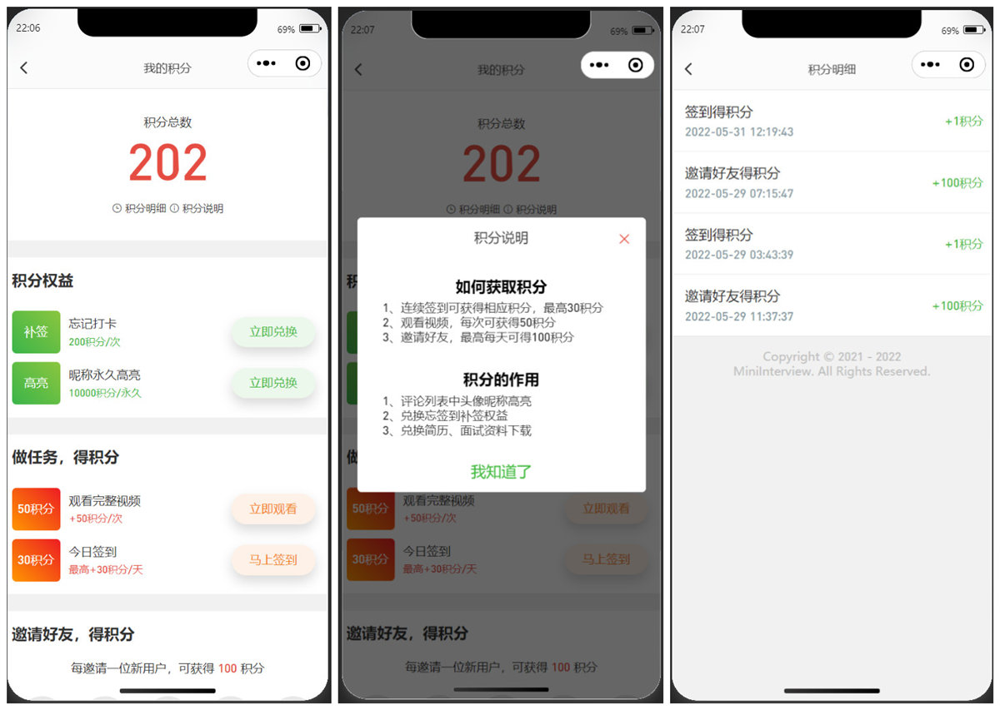

# MiniWork

## 简介

【小贝校招】面试笔试在线内推小程序，实现公司面试真题、内推、LeetCode、剑指offer等笔面试题解析，并提供校招、社招内推资讯，以及精美简历模板。使用云开发技术实现收藏、点赞、签到以及积分兑换等功能。解锁更多内容，请搜索【小贝校招】小程序，更多小程序开发教程敬请期待~

## 基本功能

- 1、剑指Offer经典题解析+代码，覆盖Java、C++和Python实现实例，归类整理各类题目；
- 2、LeetCode经典高频笔面试题详解，包含详细解析；针对不同题型归类整理；
- 3、经典算法题解析；
- 4、针对不同领域收集整理经典高频题目，包括：
  - 1）计算机基础：操作系统、Linux、计算机网络、HTTP、Socket
  - 2）数据库：数据库系统、SQL语法、SQL练习、MySQL、Redis
  - 3）编程语言：Java基础、Java容器、Java并发、Java虚拟机、Java I/O
  - 4）系统设计：基础概念、分布式、集群、攻击技术、缓存、消息队列
  - 5）面向对象：基础概念、设计模式
  - 6）编码实践：Git、Docker、构建工具、正则表达式、代码可读性、代码风格

## 小程序技术

- [X] 1、小程序基本开发、运行、部署和上传发布
- [X] 2、主题切换（黑夜模式、主题色）
- [X] 2、点赞收藏等功能
- [X] 3、签到（云开发）
- [X] 4、积分（云开发）

## 部署流程

【待完善】

## 部分效果预览

 
   

 

 
   

 

 
   

 

 
   

 

 
   

 
